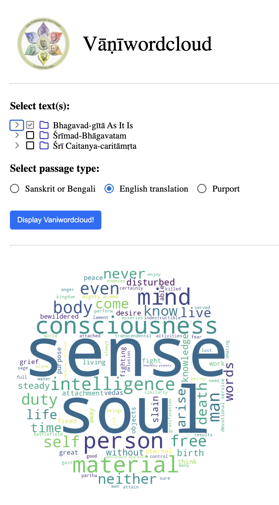

# Vaniwordcloud-app
A simple web application (Python flask backend and ReactJS frontend) to calculate and display wordclouds for A.C. Bhaktivedanta Swami Prabhupada's three books: 1) Bhagavad Gita as it is, 2) Srimad Bhagavatam, 3) Sri Caitanya Caritamrta.

#### Usage (test or deploy on localhost)

**Requirements:** 

* [Docker](https://www.docker.com/)

Steps:

1. Get a copy of the code:

        git clone git@github.com:kodymoodley/vaniwordcloud-app.git
    
2. Change into the `vaniwordcloud-app/` directory.

3. Type `docker build -f Dockerfile.combo -t vaniwordcloud-app .`

4. Type `docker run --rm -p 3000:3000 vaniwordcloud-app`

5. Navigate to: `http://localhost:3000` in your browser (I strongly recommend to use [Chrome](https://www.google.com/chrome)).

## License

Copyright (2022) Kody Moodley

Licensed under the Apache License, Version 2.0 (the "License"); you may not use this file except in compliance with the License. You may obtain a copy of the License at

[http://www.apache.org/licenses/LICENSE-2.0]([http://www.apache.org/licenses/LICENSE-2.0])
    
Unless required by applicable law or agreed to in writing, software distributed under the License is distributed on an "AS IS" BASIS, WITHOUT WARRANTIES OR CONDITIONS OF ANY KIND, either express or implied. See the License for the specific language governing permissions and limitations under the License.

